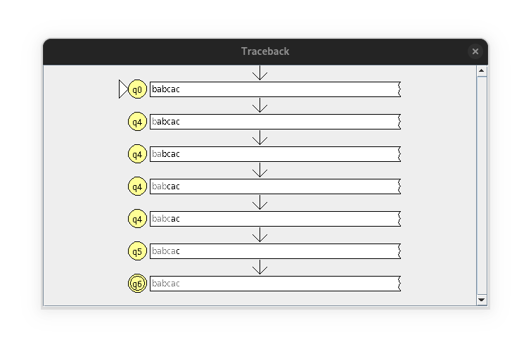

# Non-Deterministic Finite Automata Simulation Exercise in JFLAP

---

## Abstract

JFLAP (Java Formal Languages and Automata Package) is an educational software tool designed to aid in the teaching and learning of theoretical computer science concepts, particularly formal languages, automata theory, and computational theory. JFLAP provides an interactive environment where users can design, simulate, and experiment with various formal models, including finite automata, pushdown automata, Turing machines, regular expressions, and grammars.

The tool supports step-by-step simulations, multiple input string testing, and visualizations of transitions, making it ideal for understanding abstract theoretical concepts in a concrete, visual manner. JFLAP also facilitates the construction and debugging of automata, allowing users to trace computation paths and identify errors in their designs.

Widely adopted in academic settings, JFLAP bridges the gap between theory and practical application, offering students an engaging platform to explore the foundational concepts of computation. By providing hands-on experience, JFLAP enhances understanding, promotes experimentation, and serves as an invaluable resource for both instructors and students in the field of computer science.

---

## Problem Statement

Construct a Non-deterministic Finite Automaton (NFA) for the language \(L\) over the alphabet \(\{a, b, c\}\) where a string \(w\) belongs to \(L\) if it satisfies the following conditions:

1. The string starts with an \(a\) and contains `bc` as a substring.
2. The string starts with a \(b\) and ends with `ac`.

## Design Steps

- **Step 1:**
  Initial state $q_0$ with transition `a` to $q_1$ (to start the string with `a`).

- **Step 2:**
  From $q_1$, create transitions for all symbols to stay in $q_1$.

- **Step 3:**
  From $q_1$, add `b` transition to $q_2$.

- **Step 4:**
  From $q_2$, add `c` transition to accepting state $q_3$.

- **Step 5:**
  From $q_3$, add all symbol transitions to stay in $q_3$

- **Step 6:**
  From $q_0$, add `b` transition to $q_4$.

- **Step 7:**
  From $q_4$, add all symbol transitions to stay in $q_4$.

- **Step 8:**
  From $q_4$, add `a` transition to $q_5$.

- **Step 9:**
  From $q_5$, add `c` transition to accepting state $q_6$.

- **Step 10:**
  From $q_6$, add all symbol transitions to move to non-accepting state $q_7$, so that symbols after encountering `ac` are not accepted.

- **Step 11:**
  From $q_7$, add all symbol transitions moving to itself.

The final Non-Deterministic Finite Automata constructed is as follows:

## Tracing Strings

- **String 1:** `abbac`

  1. The machine transitions from $q_0$ to $q_1$ on reading `a`.
  2. Then, the machine transitions from $q_1$ to itself on reading `b`.
  3. Then, the machine transitions from $q_1$ to itself on reading `b`.
  4. Then, the machine transitions from $q_1$ to itself on reading `a`.
  5. Then, the machine transitions from $q_1$ to itself on reading `c`.

  Since $q_1$ is a non-accepting state, the string `abbac` is invalid.

  **Corresponding JFLAP Traceback**

  {width=60%}

  

- **String 2:** `abbacbca`

  1. The machine transitions from $q_0$ to $q_1$ on reading `a`.
  2. Then, the machine transitions from $q_1$ to itself on reading `b`.
  3. Then, the machine transitions from $q_1$ to itself on reading `b`.
  4. Then, the machine transitions from $q_1$ to itself on reading `a`.
  5. Then, the machine transitions from $q_1$ to itself on reading `c`.
  6. Then, the machine transitions from $q_1$ to $q_2$ on reading `b`.
  7. Then, the machine transitions from $q_2$ to $q_3$ on reading `c`.
  8. Then, the machine transitions from $q_3$ to itself on reading `a`.

  Since $q_3$ is an accepting state, the string `abbacbca` is valid.

  **Corresponding JFLAP Traceback**

  {width=60%}

  

- **String 3:** `abacab`

  1. The machine transitions from $q_0$ to $q_1$ on reading `a`.
  2. Then, the machine transitions from $q_1$ to itself on reading `b`.
  3. Then, the machine transitions from $q_1$ to itself on reading `a`.
  4. Then, the machine transitions from $q_1$ to itself on reading `c`.
  5. Then, the machine transitions from $q_1$ to itself on reading `a`.
  6. Then, the machine transitions from $q_1$ to $q_2$ on reading `b`.

  Since $q_2$ is a non-accepting state, the string `abacab` is invalid.

  **Corresponding JFLAP Traceback**

  {width=60%}

  

- **String 4:** `babacb`

  1. The machine transitions from $q_0$ to $q_4$ on reading `b`.
  2. Then, the machine transitions from $q_4$ to itself on reading `a`.
  3. Then, the machine transitions from $q_4$ to itself on reading `b`.
  4. Then, the machine transitions from $q_4$ to $q_5$ on reading `a`.
  5. Then, the machine transitions from $q_5$ to $q_6$ on reading `c`.
  6. Then, the machine transitions from $q_6$ to $q_7$ on reading `b`.

  Since $q_7$ is a non-accepting state, the string `babacb` is invalid.

  **Corresponding JFLAP Traceback**

  {width=60%}

  

- **String 5:** `baac`

  1. The machine transitions from $q_0$ to $q_4$ on reading `b`.
  2. Then, the machine transitions from $q_4$ to itself on reading `a`.
  3. Then, the machine transitions from $q_4$ to $q_5$ on reading `a`.
  4. Then, the machine transitions from $q_5$ to $q_6$ on reading `c`.

  Since $q_6$ is an accepting state, the string `baac` is valid.

  **Corresponding JFLAP Traceback**

  {width=60%}

  

- **String 6:** `babcac`

  1. The machine transitions from $q_0$ to $q_4$ on reading `b`.
  2. Then, the machine transitions from $q_4$ to itself on reading `a`.
  3. Then, the machine transitions from $q_4$ to itself on reading `b`.
  4. Then, the machine transitions from $q_4$ to itself on reading `c`.
  5. Then, the machine transitions from $q_4$ to $q_5$ on reading `a`.
  6. Then, the machine transitions from $q_5$ to $q_6$ on reading `c`.

  Since $q_6$ is an accepting state, the string `babcac` is valid.

  **Corresponding JFLAP Traceback**

  {width=60%}

  

**Multiple Run Output in JFLAP**

The results of Multiple Run prove that the manual traces for all six strings under the previous heading are correct.

---

## Five-Tuple Definition of the NFA

$M = (Q, \Sigma, \delta, q_0, F)$ where:

1. $Q = \{q_0, q_1, q_2, q_3, q_4, q_5, q_6, q_7\}$

2. $\Sigma = \{a, b, c\}$

3. $\delta: Q \times \Sigma \rightarrow \mathcal{P}(Q)$ is the transition function defined by the following table:

| State | a              | b              | c           |
| ----- | -------------- | -------------- | ----------- |
| $q_0$ | $\{q_1\}$      | $\{q_4\}$      | $\emptyset$ |
| $q_1$ | $\{q_1\}$      | $\{q_1, q_2\}$ | $\{q_1\}$   |
| $q_2$ | $\emptyset$    | $\emptyset$    | $\{q_3\}$   |
| $q_3$ | $\{q_3\}$      | $\{q_3\}$      | $\{q_3\}$   |
| $q_4$ | $\{q_4, q_5\}$ | $\{q_4\}$      | $\{q_4\}$   |
| $q_5$ | $\emptyset$    | $\emptyset$    | $\{q_6\}$   |
| $q_6$ | $\{q_7\}$      | $\{q_7\}$      | $\{q_7\}$   |
| $q_7$ | $\{q_7\}$      | $\{q_7\}$      | $\{q_7\}$   |

4. $q_0$ is the initial state

5. $F = \{q_3, q_6\}$ is the set of accepting states

---

## References

- https://www.jflap.org
- Introduction to Automata Theory, Languages and Computation, 3rd Edition, Pearson education, 2014
- https://youtu.be/lRKE2RznkUU?feature=shared

---

## Repository

All content referred to in this report have been pushed to the repository: https://github.com/themohitnair/toc-jflap-exercise

---

## Conclusion

In this exercise, a Non-Deterministic Finite Automaton (NFA) was successfully constructed and simulated in JFLAP to recognize strings satisfying specific language constraints. Through careful design and step-by-step tracing of multiple test strings, we validated the correctness of the NFA. The simulation outputs confirmed the alignment of the NFA's behavior with the given language rules, demonstrating its ability to accurately distinguish valid strings from invalid ones.

The use of JFLAP proved invaluable in visualizing transitions and debugging the automaton, reinforcing its effectiveness as an educational tool for exploring theoretical concepts. By defining the NFA using its formal five-tuple representation and testing it through multiple-run simulations, clarity and rigor in the design process was ensured. This exercise highlights the importance of tools like JFLAP in bridging abstract computational theories with practical applications, enhancing both comprehension and learning outcomes.

---
