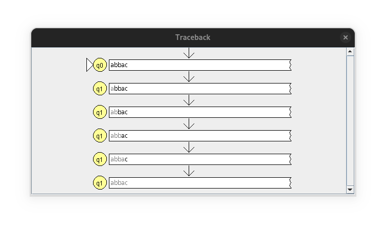
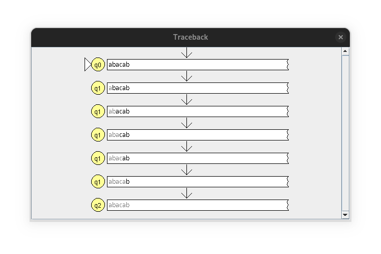

# Non-Deterministic Finite Automata Simulation Exercise in JFLAP

---

## Table of Contents

1. Problem Statement
2. Design Steps
3. Tracing Strings
   - String 1: abbac
   - String 2: abbacbca
   - String 3: abacab
   - String 4: babacb
   - String 5: baac
   - String 6: babcac
4. Multiple Run Simulation Output

---

## Problem Statement

Construct a Non-deterministic Finite Automaton (NFA) for the language \(L\) over the alphabet \(\{a, b, c\}\) where a string \(w\) belongs to \(L\) if it satisfies the following conditions:

1. The string starts with an \(a\) and contains `bc` as a substring.
2. The string starts with a \(b\) and ends with `ac`.

## Design Steps

- **Step 1:**
  Initial state $q_0$ with transition `a` to $q_1$ (to start the string with `a`).

- **Step 2:**
  From $q_1$, create transitions for all symbols to stay in $q_1$.

- **Step 3:**
  From $q_1$, add `b` transition to $q_2$.

- **Step 4:**
  From $q_2$, add `c` transition to accepting state $q_3$.

- **Step 5:**
  From $q_3$, add all symbol transitions to stay in $q_3$

- **Step 6:**
  From $q_0$, add `b` transition to $q_4$.

- **Step 7:**
  From $q_4$, add all symbol transitions to stay in $q_4$.

- **Step 8:**
  From $q_4$, add `a` transition to $q_5$.

- **Step 9:**
  From $q_5$, add `c` transition to accepting state $q_6$.

- **Step 10:**
  From $q_6$, add all symbol transitions to move to non-accepting state $q_7$, so that symbols after encountering `ac` are not accepted.

The final Non-Deterministic Finite Automata constructed is as follows:

## Tracing Strings

- **String 1:** `abbac`

  1. The machine transitions from $q_0$ to $q_1$ on reading `a`.
  2. Then, the machine transitions from $q_1$ to itself on reading `b`.
  3. Then, the machine transitions from $q_1$ to itself on reading `b`.
  4. Then, the machine transitions from $q_1$ to itself on reading `a`.
  5. Then, the machine transitions from $q_1$ to itself on reading `c`.

  Since $q_1$ is a non-accepting state, the string `abbac` is invalid.

  **Corresponding JFLAP Traceback**

  {width=60%}

  

- **String 2:** `abbacbca`

  1. The machine transitions from $q_0$ to $q_1$ on reading `a`.
  2. Then, the machine transitions from $q_1$ to itself on reading `b`.
  3. Then, the machine transitions from $q_1$ to itself on reading `b`.
  4. Then, the machine transitions from $q_1$ to itself on reading `a`.
  5. Then, the machine transitions from $q_1$ to itself on reading `c`.
  6. Then, the machine transitions from $q_1$ to $q_2$ on reading `b`.
  7. Then, the machine transitions from $q_2$ to $q_3$ on reading `c`.
  8. Then, the machine transitions from $q_3$ to itself on reading `a`.

  Since $q_3$ is an accepting state, the string `abbacbca` is valid.

  **Corresponding JFLAP Traceback**

  {width=60%}

  

- **String 3:** `abacab`

  1. The machine transitions from $q_0$ to $q_1$ on reading `a`.
  2. Then, the machine transitions from $q_1$ to itself on reading `b`.
  3. Then, the machine transitions from $q_1$ to itself on reading `a`.
  4. Then, the machine transitions from $q_1$ to itself on reading `c`.
  5. Then, the machine transitions from $q_1$ to itself on reading `a`.
  6. Then, the machine transitions from $q_1$ to $q_2$ on reading `b`.

  Since $q_2$ is a non-accepting state, the string `abacab` is invalid.

  **Corresponding JFLAP Traceback**

  {width=60%}

  

- **String 4:** `babacb`

  1. The machine transitions from $q_0$ to $q_4$ on reading `b`.
  2. Then, the machine transitions from $q_4$ to itself on reading `a`.
  3. Then, the machine transitions from $q_4$ to itself on reading `b`.
  4. Then, the machine transitions from $q_4$ to $q_5$ on reading `a`.
  5. Then, the machine transitions from $q_5$ to $q_6$ on reading `c`.
  6. Then, the machine transitions from $q_6$ to $q_7$ on reading `b`.

  Since $q_7$ is a non-accepting state, the string `babacb` is invalid.

  **Corresponding JFLAP Traceback**

  {width=60%}

  

- **String 5:** `baac`

  1. The machine transitions from $q_0$ to $q_4$ on reading `b`.
  2. Then, the machine transitions from $q_4$ to itself on reading `a`.
  3. Then, the machine transitions from $q_4$ to $q_5$ on reading `a`.
  4. Then, the machine transitions from $q_5$ to $q_6$ on reading `c`.

  Since $q_6$ is an accepting state, the string `baac` is valid.

  **Corresponding JFLAP Traceback**

  {width=60%}

  

- **String 6:** `babcac`

  1. The machine transitions from $q_0$ to $q_4$ on reading `b`.
  2. Then, the machine transitions from $q_4$ to itself on reading `a`.
  3. Then, the machine transitions from $q_4$ to itself on reading `b`.
  4. Then, the machine transitions from $q_4$ to itself on reading `c`.
  5. Then, the machine transitions from $q_4$ to $q_5$ on reading `a`.
  6. Then, the machine transitions from $q_5$ to $q_6$ on reading `c`.

  Since $q_6$ is an accepting state, the string `babcac` is valid.

  **Corresponding JFLAP Traceback**

  {width=60%}

  

**Multiple Run Output in JFLAP**

The results of Multiple Run prove that the manual traces for all six strings under the previous heading are correct.

---
